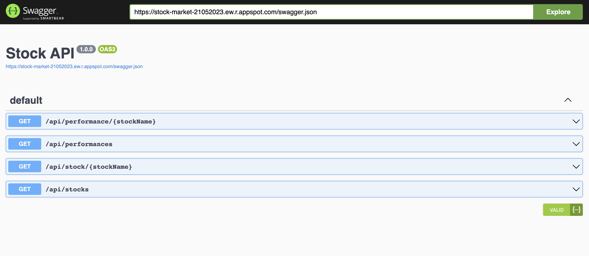

# Stock App
Stock App is a web application that provides information about stocks and their performance. It utilizes the Flask framework and the yfinance library to retrieve stock data and calculate various performance metrics.

## Features
- Retrieve stock data for multiple stocks and display historical prices.
- Calculate and display the cumulative return, annualized return, and annualized volatility for individual stocks.
- View stock data and performance metrics through a Swagger UI interface. 
	https://stock-market-21052023.ew.r.appspot.com/api/docs/

	

## Installation
1. Clone the repository:

	`git clone https://github.com/DariaCode/stock-app.git`

2. Install the required dependencies:

	`pip install -r requirements.txt`

3. Run the application:

	`python main.py`

The application will start running on http://127.0.0.1:5000/.

## API Endpoints
`/api/stocks` (GET): Retrieve stock data for multiple stocks.

`/api/stock/<stockName>` (GET): Retrieve stock data for a specific stock.

`/api/performances` (GET): Retrieve performance metrics for multiple stocks.

`/api/performance/<stockName>` (GET): Retrieve performance metrics for a specific stock.

## Swagger UI
You can access the Swagger UI interface to explore the available endpoints and test the API. Open your browser and go to http://127.0.0.1:5000/api/docs to access the Swagger UI.

## License
This project is licensed under the [MIT License](https://chat.openai.com/c/LICENSE).